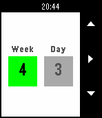
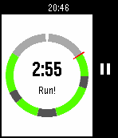

# Couch to 5K watchapp for Pebble

This watchapp provides a basic interface for timing Couch to 5K runs on a Pebble
smartwatch. The specific C25K variation is the
[NHS programme](https://www.nhs.uk/live-well/exercise/couch-to-5k-week-by-week/).

There are other apps to do this, but this is mine. More seriously, I wanted an
app that showed my progress on the entire run, not just what I was doing in the
here and now. When suffering through intervals, I need to know the end of the
pain is in sight.

I only physically own an original Pebble and a Pebble Time, but this should work
on any of the Pebble models. It looks a bit wonky on the round screen, but
that's mostly because designing for a round screen wasn't really my priority.
PRs welcome.

## Installation

I haven't uploaded this to the Rebble app store as yet, as I have to navigate
that process. If you're a developer, you could [build it](#building) using the
Pebble SDK and install it on your watch.

## Screenshots

 

## Development

### Building

This should work with any v4 Pebble SDK, but I've only used 4.5 and 4.6. The
standard process should work fine:

```sh
pebble build
```

You should then have a `build/c25k-pebble.pbw` that you can do with as you
please.

The Makefile includes some handy rules, so you can also `make` to get a debug
build, or `make release` to get a release build.

### Code organisation

The general flow is pretty straightforward. There are three windows:

1. The "selector", which is used to select which activity to run, and
2. The "activity", which displays the actual activity in progress.
3. The "reward", which is shown at the end of an activity.

These are encapsulated in corresponding source files, and are implemented in the
same general pure C OO style as the Pebble API. There's also a "number" layer,
which provides a bounded number chooser control that's more composable than the
one that comes with the Pebble SDK, and a "programme" module that implements the
generic C25K logic.

### Testing

There are unit tests for some of the underlying programme logic, which you can
build and run with `make test`, provided you have a C compiler and Valgrind
available.

## Contributing

In truth, I don't really intend on doing much more with this, since it scratches
my itch. Nevertheless, issues and PRs are open.

## Credits

The icon is CC-BY 4.0 licensed, and is by
[CoreUI](https://commons.wikimedia.org/w/index.php?curid=85712863).
